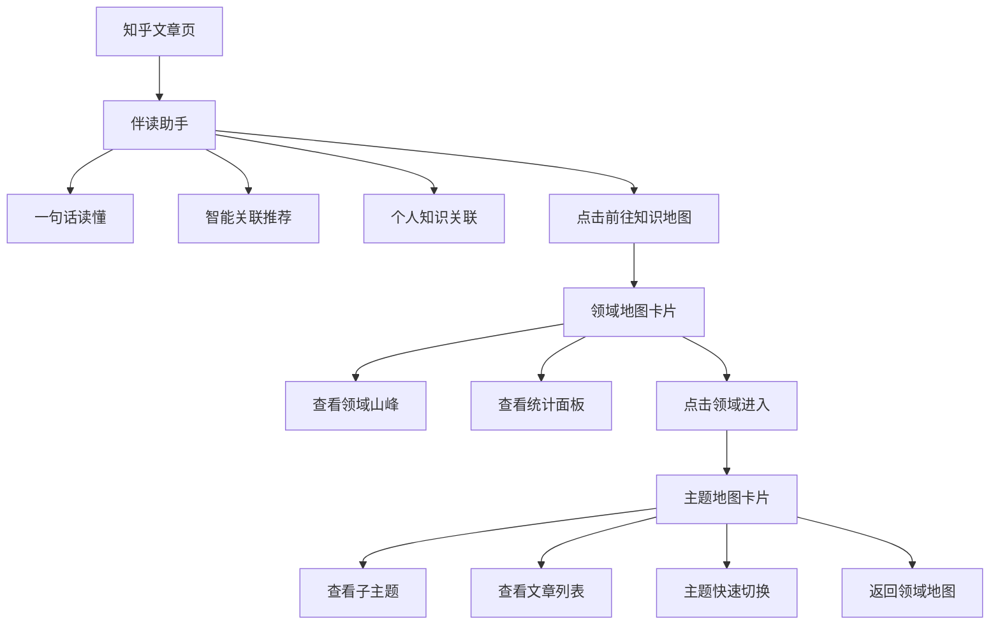

# 知乎知识地图 - 产品需求文档

## 1. 产品概述
知乎知识地图是一款基于用户阅读历史和收藏夹的知识可视化应用，通过刘看山伴读助手、领域地图和主题地图三层结构，帮助用户更好地管理和探索知识领域。

- **核心目标**：将用户的阅读数据转化为可视化的知识图谱，提升阅读体验和知识管理效率
- **目标用户**：知乎深度用户，特别是关注多个知识领域的学习者

## 2. 核心功能

### 2.1 功能模块

1. **伴读助手**：左下角浮动面板，提供文章摘要、相关推荐、收藏关联等功能
2. **领域地图**：第一层知识可视化，展示用户关注的所有知识领域
3. **主题地图**：第二层详细展开，展示特定领域下的子主题和文章

### 2.2 页面详情

| 页面名称 | 模块名称 | 功能描述 |
|----------|----------|----------|
| 伴读助手 | 一句话读懂 | 显示当前文章的核心内容摘要 |
| 伴读助手 | 智能关联推荐 | 基于当前文章推荐相关阅读 |
| 伴读助手 | 个人知识关联 | 展示与收藏夹相关的文章内容 |
| 伴读助手 | 前往知识地图 | 跳转到领域地图页面 |
| 领域地图 | 左侧统计面板 | 用户信息、阅读统计、掌握度、吃灰提醒 |
| 领域地图 | 核心山峰图 | 以山峰形式展示各个知识领域 |
| 领域地图 | 子领域标签 | 每个领域周围的子分类标签 |
| 领域地图 | 刘看山提示 | 智能推荐和引导气泡 |
| 领域地图 | 全局缩略图 | 右下角领域地图缩略导航 |
| 主题地图 | 左侧详情面板 | 当前领域统计、阅读进度、更新时间 |
| 主题地图 | 主题知识图谱 | 子主题分布和关联关系图 |
| 主题地图 | 文章列表 | 各主题下的文章及阅读状态 |
| 主题地图 | 主题快速切换 | 右侧主题列表快速导航 |
| 主题地图 | 文章预览 | 选中文章的详情预览卡片 |

## 3. 核心流程

用户在使用知乎阅读文章时，左下角出现刘看山伴读助手。助手提供文章摘要、相关推荐和收藏关联功能。用户点击"前往知识地图"后，弹出领域地图卡片，展示所有知识领域的山峰图。点击任意领域山峰，进入该领域的主题地图，查看子主题和文章详情。用户可以通过返回按钮回到上一层，或在主题间快速切换。

## 4. 用户界面设计

### 4.1 设计风格

- **主色调**：知乎蓝 `#0066FF` 作为主色，搭配渐变色系
- **辅助色**：
  - 人工智能：蓝紫色渐变 `#6366F1` → `#8B5CF6`
  - 哲学：绿色系 `#10B981` → `#34D399`
  - 文学：橙黄色系 `#F59E0B` → `#FBBF24`
  - 经济学：紫色系 `#8B5CF6` → `#A78BFA`
  - 社会学：青色系 `#06B6D4` → `#22D3EE`
  - 心理学：粉色系 `#EC4899` → `#F472B6`
  - 艺术：靛蓝色系 `#3B82F6` → `#60A5FA`
  - 法学：深紫色 `#7C3AED` → `#8B5CF6`
  - 历史：琥珀色 `#D97706` → `#F59E0B`

- **按钮样式**：圆角矩形，主按钮使用渐变填充，次级按钮使用描边样式
- **字体**：系统默认字体栈，标题使用较粗字重
- **布局**：卡片式弹窗设计，占屏幕约2/3宽度，圆角16px
- **图标风格**：线性图标，配合渐变色背景

### 4.2 页面设计概述

| 页面名称 | 模块名称 | UI元素 |
|----------|----------|--------|
| 伴读助手 | 整体面板 | 圆角卡片、阴影浮动、知乎蓝头部 |
| 伴读助手 | 内容区 | 图标+文字列表、文章缩略图、标签 |
| 伴读助手 | 底部按钮 | 渐变蓝色按钮、阅读统计 |
| 领域地图 | 卡片容器 | 大尺寸弹窗、圆角、白色背景 |
| 领域地图 | 左侧栏 | 固定宽度240px、用户信息卡片、统计图表 |
| 领域地图 | 核心区域 | 山峰SVG图形、浮动标签、连接线 |
| 领域地图 | 右下角 | 刘看山形象、提示气泡、缩略地图 |
| 主题地图 | 卡片容器 | 与领域地图一致的大尺寸弹窗 |
| 主题地图 | 左侧栏 | 领域图标、主题列表、进度条 |
| 主题地图 | 核心区域 | 中心辐射式布局、主题节点、文章列表 |
| 主题地图 | 右侧栏 | 主题切换列表、文章预览卡片 |

### 4.3 动画效果

- **卡片弹出**：从底部滑入 + 淡入，duration: 300ms, easing: cubic-bezier(0.4, 0, 0.2, 1)
- **页面切换**：卡片翻转效果，3D rotateY，duration: 400ms
- **山峰悬停**：scale(1.05) + 阴影增强，duration: 200ms
- **标签出现**：staggered fadeIn + translateY，delay: 50ms each
- **进度条**：width 从0到目标值，duration: 800ms, easing: ease-out
- **刘看山提示**：气泡弹出动画，scale(0.8) → scale(1)，duration: 200ms

### 4.4 响应式设计

- **桌面优先**：主要适配1920×1080及以上分辨率
- **卡片尺寸**：固定宽度1200px，高度约800px
- **移动端适配**：卡片全屏显示，左侧栏可折叠

## 5. 数据需求

### 5.1 用户信息
- 头像、昵称、等级、称号
- 已关注领域数、总阅读文章数

### 5.2 阅读统计
- 已读文章数及百分比
- 浏览中文章数及百分比
- 未读推荐文章数
- 知识掌握度（入门/进阶/精通分布）
- 吃灰内容数量（超过30天未读）

### 5.3 领域数据
- 领域名称、图标、文章数量
- 子领域列表及文章数
- 领域颜色标识

### 5.4 主题数据
- 主题名称、文章数量
- 下属文章列表（标题、摘要、阅读状态、阅读时间）
- 主题间的关联关系
