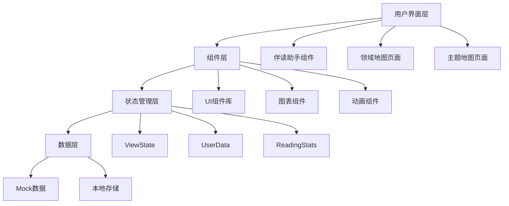

# 知乎知识地图 - 技术架构文档

## 1. 架构设计



## 2. 技术选型

- **前端框架**：React 18 + TypeScript
- **构建工具**：Vite 5
- **样式方案**：Tailwind CSS 3
- **UI组件库**：shadcn/ui
- **动画库**：Framer Motion
- **图标库**：Lucide React
- **图表**：自定义SVG + CSS动画

## 3. 项目结构

```
src/
├── components/           # 组件目录
│   ├── assistant/       # 伴读助手组件
│   │   ├── ReadingAssistant.tsx
│   │   ├── ArticleSummary.tsx
│   │   ├── RelatedArticles.tsx
│   │   └── CollectionLinks.tsx
│   ├── domain-map/      # 领域地图组件
│   │   ├── DomainMap.tsx
│   │   ├── StatsPanel.tsx
│   │   ├── MountainGraph.tsx
│   │   ├── DomainNode.tsx
│   │   └── LiuKanShanTips.tsx
│   ├── topic-map/       # 主题地图组件
│   │   ├── TopicMap.tsx
│   │   ├── TopicDetail.tsx
│   │   ├── TopicGraph.tsx
│   │   ├── ArticleList.tsx
│   │   └── TopicSwitcher.tsx
│   └── ui/              # 通用UI组件
│       ├── Card.tsx
│       ├── Progress.tsx
│       ├── Badge.tsx
│       └── Avatar.tsx
├── hooks/               # 自定义Hooks
│   ├── useViewState.ts
│   └── useReadingData.ts
├── data/                # 数据文件
│   ├── mockData.ts
│   └── types.ts
├── styles/              # 样式文件
│   └── globals.css
├── lib/                 # 工具函数
│   └── utils.ts
├── App.tsx
└── main.tsx
```

## 4. 路由定义

| 路由 | 用途 |
|------|------|
| / | 主页面，包含伴读助手入口 |
| /demo | 演示页面，展示所有功能 |

## 5. 数据结构定义

```typescript
// 用户数据
interface UserData {
  id: string;
  avatar: string;
  nickname: string;
  level: number;
  title: string;
  followedDomains: number;
  totalArticles: number;
}

// 阅读统计
interface ReadingStats {
  read: { count: number; percentage: number };
  browsing: { count: number; percentage: number };
  unread: { count: number; label: string };
  mastery: {
    beginner: number;
    intermediate: number;
    advanced: number;
  };
  dustyContent: number;
}

// 领域数据
interface Domain {
  id: string;
  name: string;
  icon: string;
  articleCount: number;
  color: string;
  gradient: string[];
  subDomains: SubDomain[];
  position: { x: number; y: number };
}

// 子领域
interface SubDomain {
  id: string;
  name: string;
  articleCount: number;
}

// 主题数据
interface Topic {
  id: string;
  name: string;
  articleCount: number;
  domainId: string;
  articles: Article[];
  position: { x: number; y: number };
}

// 文章数据
interface Article {
  id: string;
  title: string;
  summary: string;
  status: 'read' | 'browsing' | 'unread';
  readTime?: number;
  tags: string[];
}

// 视图状态
interface ViewState {
  currentView: 'assistant' | 'domain-map' | 'topic-map';
  selectedDomain: Domain | null;
  selectedTopic: Topic | null;
}
```

## 6. 组件接口定义

### ReadingAssistant Props
```typescript
interface ReadingAssistantProps {
  articleSummary: string;
  relatedArticles: Article[];
  collectionLinks: Article[];
  todayStats: { read: number; domains: number };
  onOpenDomainMap: () => void;
}
```

### DomainMap Props
```typescript
interface DomainMapProps {
  userData: UserData;
  stats: ReadingStats;
  domains: Domain[];
  onDomainClick: (domain: Domain) => void;
  onClose: () => void;
}
```

### TopicMap Props
```typescript
interface TopicMapProps {
  domain: Domain;
  topics: Topic[];
  onTopicChange: (topic: Topic) => void;
  onBack: () => void;
}
```

## 7. 动画规范

### 卡片弹出动画
```typescript
const cardVariants = {
  hidden: { opacity: 0, y: 50, scale: 0.95 },
  visible: { 
    opacity: 1, 
    y: 0, 
    scale: 1,
    transition: { duration: 0.3, ease: [0.4, 0, 0.2, 1] }
  },
  exit: { 
    opacity: 0, 
    y: 50, 
    scale: 0.95,
    transition: { duration: 0.2 }
  }
};
```

### 页面翻转动画
```typescript
const flipVariants = {
  front: { rotateY: 0 },
  back: { 
    rotateY: 180,
    transition: { duration: 0.4, ease: "easeInOut" }
  }
};
```

### 山峰悬停动画
```typescript
const mountainHover = {
  scale: 1.05,
  boxShadow: "0 20px 40px rgba(0,0,0,0.15)",
  transition: { duration: 0.2 }
};
```

## 8. 样式规范

### Tailwind 配置扩展
```javascript
// tailwind.config.js
module.exports = {
  theme: {
    extend: {
      colors: {
        zhihu: {
          blue: '#0066FF',
          light: '#EBF3FF',
        },
        domain: {
          ai: { from: '#6366F1', to: '#8B5CF6' },
          philosophy: { from: '#10B981', to: '#34D399' },
          literature: { from: '#F59E0B', to: '#FBBF24' },
          economics: { from: '#8B5CF6', to: '#A78BFA' },
          sociology: { from: '#06B6D4', to: '#22D3EE' },
          psychology: { from: '#EC4899', to: '#F472B6' },
          art: { from: '#3B82F6', to: '#60A5FA' },
          law: { from: '#7C3AED', to: '#8B5CF6' },
          history: { from: '#D97706', to: '#F59E0B' },
        }
      },
      animation: {
        'fade-in': 'fadeIn 0.3s ease-out',
        'slide-up': 'slideUp 0.3s ease-out',
        'scale-in': 'scaleIn 0.2s ease-out',
      },
      keyframes: {
        fadeIn: {
          '0%': { opacity: '0' },
          '100%': { opacity: '1' },
        },
        slideUp: {
          '0%': { transform: 'translateY(20px)', opacity: '0' },
          '100%': { transform: 'translateY(0)', opacity: '1' },
        },
        scaleIn: {
          '0%': { transform: 'scale(0.9)', opacity: '0' },
          '100%': { transform: 'scale(1)', opacity: '1' },
        },
      },
    },
  },
};
```

## 9. 性能优化

- 使用 React.memo 优化组件重渲染
- 图片懒加载和压缩
- CSS动画优先，减少JS动画
- 使用 will-change 优化动画性能
- 大数据列表使用虚拟滚动
